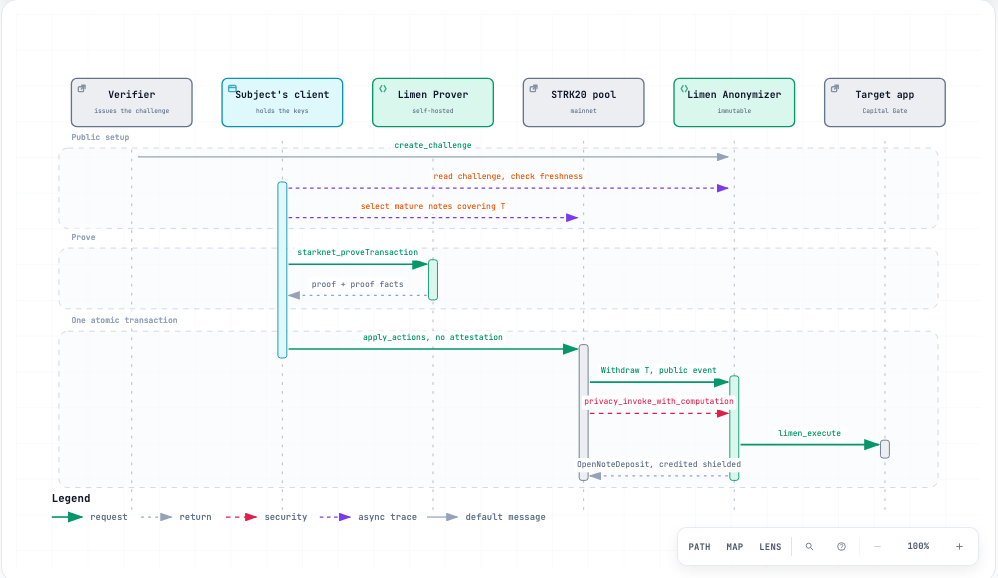

# Architecture

Limen is small. One Cairo contract does the work, one reference contract shows how to
consume it, and the rest is the infrastructure needed to make a proof and to check the
result honestly.

The whole system exists to make one sentence enforceable: *this subject mobilised exactly
this much of this token through the STRK20 pool, and the bound action ran.*

---

## The shape


*[Open the interactive version](docs/diagrams/limen-architecture.html)* — guided views for the
clearance path, the proving infrastructure, and what holds a key.

Two things about this diagram are load-bearing.

**The prover is never inside a Worker.** Proving is minutes of a whole machine — measured
at 51.6 s, 56.0 s and 80.8 s for the mainnet clearances, on 4 vCPU and 32 GB. It runs as a real
Linux container on a dedicated host with no public address of its own, reachable only
from the gateway across a private network.

It also runs a **rebuild** of the pinned upstream prover rather than the published image,
because the published one is compiled for a single microarchitecture and aborts with
`SIGILL` on ordinary hardware. Same commit, same crate, same features; only the CPU pin
differs. CONTRIBUTIONS.md C-1.

**The web app holds no signing key.** It reads chain state, serves challenges, and relays
to the gateway. Users clear challenges with their own keys. A compromised edge worker can
serve wrong information; it cannot mint a clearance.

---

## On chain

### LimenAnonymizer

A stateful STRK20 anonymizer. The pool withdraws exactly the threshold to it, calls it,
and credits the same amount straight back into a shielded open note.

```
UseNote(T) → Withdraw(T → Limen) → privacy_invoke_with_computation
                                        ├── target.limen_execute(clearance)
                                        └── OpenNoteDeposit(T → open note)
```

Two properties do the work, and both come from the pool rather than from calldata.

**The subject.** When a transaction uses `ComputeAndInvoke`, the pool derives

```
identity_key = poseidon(IDENTITY_KEY_TAG, user_addr, user_private_key, contract_address)
```

inside the proven execution and passes it to `privacy_compute`. Deriving it needs the
private viewing key, so a subject cannot be presented by someone who does not hold it. It
is stable per (user, anonymizer), differs at every other anonymizer, and contains no
address.

**The amount.** `privacy_compute` snapshots the anonymizer's token balance at the proving
base, before any value moves. The proof carries that snapshot into the invoke, which
measures `balance_now - balance_before` and requires it to equal the threshold exactly.

Exact equality rather than a lower bound keeps the anonymizer's resting balance invariant
across every clearance, so a stray balance is never swept into someone's note.

The contract has no owner, no admin, no pause, no upgrade and no sweep. Creating a
challenge is permissionless and authorises nothing on its own.

### CapitalGate

The reference target. Its job is to prove Limen can authorise a real contract action, not
to be a second product. It records an allocation against a subject pseudonym, and
enforces its own rules independently of what any challenge claims: the caller must be its
Limen deployment, the action must be one it recognises, the token must be the one it
accepts, and the amount must clear its own minimum. A verifier cannot lower the gate's
bar by issuing a cheaper challenge.

### The interface a target implements

```cairo
#[starknet::interface]
pub trait ILimenTarget<T> {
    fn limen_execute(ref self: T, clearance: LimenClearance);
}
```

Limen never accepts a caller-supplied selector. A challenge can only cause
`limen_execute` to run on its bound target, which is what stops the anonymizer being
usable as a general-purpose call proxy while it is holding capital.

---

## Off chain

| Package | Responsibility |
| --- | --- |
| `protocol-config` | Live chain reads, token arithmetic, upstream pins. Everything governance can change is read from chain, never hardcoded |
| `proving-core` | The `LimenProvingProvider` seam, failure classification, retry policy, redaction |
| `limen-sdk` | Challenge and subject derivation, clearance planning and validation, the transaction verifier |
| `prover-gateway` | Everything between a client and the proving binary |
| `apps/web` | The product, on Cloudflare Workers |
| `infra/fly` | The prover host: two apps, private networking, per-session lifecycle |

### The proving seam

Limen never talks to a prover directly. Everything goes through one interface, so the
self-hosted prover, a wallet-managed prover and a test double are interchangeable, and so
the app can report which one produced a given proof.

```ts
interface LimenProvingProvider {
  health(): Promise<ProviderHealth>;
  prove(request: ProvingRequest): Promise<ProvingResult>;
}
```

Retry behaviour around proving is not invented. A `ProvingError` carries a `retryable`
flag derived from the prover's own documented JSON-RPC codes, and only `busy`, `timeout`
and `unavailable` are transient. A rejected proof or an invalid request fails on the
first attempt: repeating it cannot change the outcome and would burn the scarcest
resource Limen operates.

### The gateway

Runs beside the prover on the host, single-process, so admission decisions are genuinely
serialised.

- **Auth.** Bearer token on every proving request. Without it the gateway would be an
  open proving oracle.
- **Validation before cost.** Shape, felts, block finality, size bounds and output-field
  smuggling are all rejected before the prover is touched, so a malformed payload can
  never occupy the single proving slot.
- **Admission.** `inFlight` is one counter and `active`/`queued` are derived from it.
  Two counters that must agree eventually disagree, and a drifted `active` permanently
  consumes slots.
- **Idempotency.** A repeated `Idempotency-Key` returns the original result instead of
  proving twice.
- **Worker failure.** A job running when the prover dies is terminal, not in flight. The
  gateway detects the restart on its next health probe and releases those jobs, so a
  crash cannot wedge it at "busy" forever.
- **Health that means something.** `healthy: true` means the prover answered JSON-RPC,
  not that a process exists.
- **Redaction.** No request content reaches a log, a metric, an error, or a job record.

---

## Data flow, one clearance



*[Open the interactive version](docs/diagrams/limen-clearance.html)*

Submission passes no screening attestation, because a clearance contains no `Deposit`
action. That is what lets the Limen self-hosted prover produce the whole thing: only the
initial shielding deposit needs the official screening path.

The withdraw and the credit back are what make a clearance externally checkable. The pool
publishes what it withdrew and what it credited, so `scripts/verify-mainnet.ts` can reconstruct the
entire mechanism from a transaction hash without trusting the app, the SDK, or any
indexer.

---

## Where state lives

| State | Where | Why there |
| --- | --- | --- |
| Challenges and consumption | anonymizer storage | must be atomic with the capital flow |
| Allocations | target storage | it is the application's own record |
| Job counters, latencies | gateway memory | ephemeral; a proof in flight when the process dies is gone anyway |
| Idempotent results | gateway memory, 30-minute window | long enough to cover a retry storm |
| Deployment addresses | Worker environment | rendered as content, not frozen at build |
| Evidence | `evidence/`, committed | must be diffable and reproducible |

There is no database. Nothing Limen needs to remember outlives a transaction except what
is already on chain, and adding a store would mean deciding what happens when it
disagrees with the chain.

---

## Verification

Two independent implementations of challenge-id derivation, in Cairo and TypeScript, both
asserting the same pinned constant. Two implementations agreeing with each other proves
nothing; agreeing with a fixed value does.

The contract test fixture reproduces the pool's real `ComputeAndInvoke` sequence — compute
at the proving base, then withdraw, invoke, deserialize the return with the pool's own
trailing-data check, and pull. Splitting compute from apply is what lets a test insert
activity between proving and execution, which is where the interesting attack lives.

The 100-case campaign is generated from a seeded vector set, so the same commit always
produces the same campaign. Each case is an independent test and every adversarial case
asserts the exact error it must fail with, so a case failing for the wrong reason counts
as a failure.

`tools/verify-pool-source.ts` compiles the pinned upstream revision and compares the class
hash against what is deployed. If that stops matching, every interface assumption below it
is suspect, so CI fails rather than continuing.
