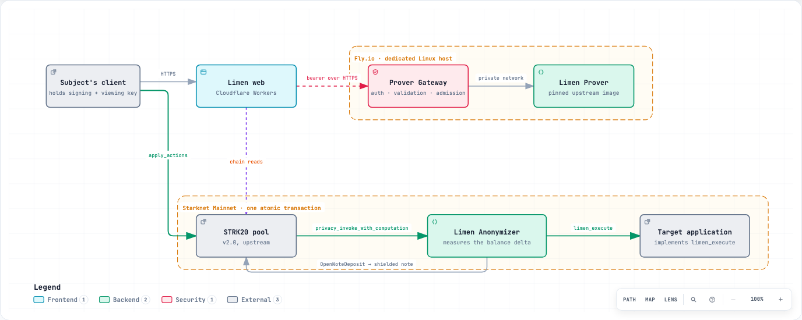

# Limen

Applications often need to know whether you have enough capital, which normally means
showing them a wallet and everything in it.

Limen lets a Starknet application require a capital threshold without asking you to
reveal your total shielded balance.

```
  spend                withdraw               execute              return
  ─────                ────────               ───────              ──────
  valid STRK20    →    exactly T to      →    the bound       →   T credited back
  private notes        Limen Anonymizer       target action        to a shielded note

  ──────────────────── one atomic transaction ────────────────────
       a revert anywhere moves no capital and consumes no challenge
```

If you cannot supply the threshold, nothing clears. If you can, the application learns
the one condition it asked about and nothing else: not your balance, not your other
notes, not your address.

**Live demo** — <https://limen.timjosh507.workers.dev> ·
**Integrating** — [docs/INTEGRATING.md](docs/INTEGRATING.md)

---

## Why this needs to exist

Gating on capital is ordinary. Allowlists, OTC counterparty checks, governance tiers,
lending minimums. All of them need one bit: *does this person control at least T?* All of
them get it by having you connect a wallet, which hands over everything.

The obvious fix is to prove `balance >= T` in zero knowledge, and it does not hold up.

**A balance proof is a snapshot.** Prove you hold T, move the capital, prove again for
someone else. The same money certifies unlimited claims because nothing was committed.

**A balance can be borrowed.** Flash-loaned or lent for a block. Proving a balance at an
instant says very little about control.

Limen does not prove a balance. It requires the capital to be *mobilised*: exactly T
leaves your private notes, passes through the anonymizer, triggers the application's
action, and returns to a shielded note, all in one atomic transaction. The claim is not
"I have T", it is "I just moved T" — single-use, consumed on chain, and impossible to
replay.

Two properties make that enforceable rather than merely asserted, and both come from the
pool rather than from anything a caller supplies.

**The subject cannot be forged.** The pool derives
`poseidon(TAG, address, private_key, contract)` inside the proven execution. Producing it
needs the private key, it contains no address, and it differs at every other anonymizer,
so it cannot be correlated across applications.

**The amount is measured, not claimed.** The contract snapshots its own balance at the
proving base and requires `balance_now - balance_before` to equal the threshold exactly.
No calldata field asserts it.

The wider point: shielded funds are usually inert, because the moment they have to mean
something to an application you unshield and the privacy was pointless. Limen makes
shielded capital usable as a credential without unshielding it.

---

## Status

Live on Starknet Mainnet.

| | |
| --- | --- |
| Protocol map verified against the deployed pool class | reproducible, byte-identical |
| Contracts deployed to mainnet | anonymizer + reference gate |
| **Capital challenge cleared on mainnet** | **three times, all fully verified** |
| Proven by Limen's own self-hosted prover | 51.6 s, 56.0 s, 80.8 s |
| Adversarial campaign | 100/100 as specified, 0 false clearances |
| Prover replay benchmark | 10/10 provable mainnet transactions, p50 49.1 s |
| Tests | 166 Cairo + 70 TypeScript, 0 failures |

`evidence/claims.json` is the full ledger: 16 claims, each with the artefact that proves
it and the command to regenerate that artefact.

## Mainnet evidence

```
anonymizer    0x53a90767664a1ff4421d0782f97b6ccb6248c1a1c80112f2e91460f015652b1
capital gate  0x10004102d54305e99a6c7da1c795c785ae21800577634d9f5b1995dc6e25b0c
```

| Transaction | What it is |
| --- | --- |
| [`0x6e597fbe…`](https://voyager.online/tx/0x6e597fbed2be9e4d829f62d456bf762c69a6845add766deecfebbda725dd4aa) | Canonical Limen clearance |
| [`0x6f155afb…`](https://voyager.online/tx/0x6f155afb8098972a32feee8ab7059177e7dff17bd57bca1b1909b87d0a2ec54) | Second Limen clearance |
| [`0x2277d769…`](https://voyager.online/tx/0x2277d769273da51bcc30a5ac41d0bb3fc45906a0a59917202d22f83d383e566) | Third Limen clearance |

Nothing here is self-reported. `scripts/verify-mainnet.ts` re-reads each receipt and
reconstructs the mechanism from pool and contract events, refusing any hash whose events
do not. All three clearances pass every check:

```
ok  STRK20 pool touched
ok  anonymizer invoked via privacy_invoke_with_computation
ok  challenge cleared
ok  target action executed
ok  capital returned to a shielded note
ok  returned amount equals the threshold
ok  funded entirely from private notes
```

```sh
node --experimental-strip-types scripts/verify-mainnet.ts \
  0x6e597fbed2be9e4d829f62d456bf762c69a6845add766deecfebbda725dd4aa
```

The protocol map is checkable too — the pinned upstream revision compiles to exactly the
class deployed at the pool:

```
upstream commit   74841caf0466d122117945e28ed983e2864c8fc1
computed class    0x67dddd89d80fedadc06b6f160798f94800a4a70164e5a24301cd0d6076b554d
deployed class    0x67dddd89d80fedadc06b6f160798f94800a4a70164e5a24301cd0d6076b554d
```

That matters because the monorepo's `main` is at pool version 2.1 while mainnet runs 2.0,
and they differ in ways that decide whether a third-party anonymizer can exist at all.

## The privacy boundary

Vague privacy claims are worse than none, so here is the whole thing.

**Becomes public.** The token and threshold being proven. The target application and the
action authorised. The challenge identifier, and that it was consumed. A subject
pseudonym scoped to this anonymizer. That the pool withdrew the threshold and credited it
back. The time it landed.

**Stays private.** Your total shielded balance. How much more than the threshold you
hold. Which notes you spent and their amounts. Your Starknet address, which the target
never receives. Your unrelated shielded activity. Your viewing key and signing key.

**Reduces privacy anyway.** Deposits into and withdrawals out of the pool are public by
protocol design; only movement inside is shielded. Timing correlation can link a
shielding deposit to a later clearance, so shield ahead of time. A distinctive threshold
narrows the anonymity set. The threshold itself is disclosed to the verifier on purpose.

**And one thing Limen does not prove.** An ERC-20 balance carries no provenance. Between
the proving base and execution, a subject can transfer the token to the anonymizer
publicly, and the contract cannot distinguish that from the pool's own withdrawal. The
capital condition still holds — a subject who cannot raise the threshold still cannot
clear — but the contract does not enforce that every unit came from shielded notes.

This cannot be closed on chain, and the reasoning is in [DECISIONS.md](DECISIONS.md)
D-007. It is measured rather than described: the pool publishes
`Withdrawal{to_addr, token, amount}` in the same transaction, so
`Withdrawal.amount == threshold` means the whole amount came from private notes. The
verifier asserts it on every published transaction and the explorer shows it.

Limen proves a bounded capital condition. It is not identity anonymity, and it is not
proof of solvency.

## Run it locally

```sh
git clone https://github.com/winsznx/limen && cd limen
./scripts/bootstrap.sh          # toolchain check, deps, pinned upstream SDK
pnpm test                       # 70 TypeScript tests
cd contracts && snforge test    # 166 Cairo tests
```

Then the evidence, which needs no keys, no funds and no network beyond a public RPC:

```sh
node --experimental-strip-types tools/verify-pool-source.ts   # pinned source == deployed class
node --experimental-strip-types tools/probe-mainnet.ts        # live pool parameters
node --experimental-strip-types scripts/run-campaign.ts       # 100-case adversarial campaign
```

Or check the whole thing at once. `scripts/clean-room.sh` clones into a fresh directory,
proves no secret survived the clone or the git history, bootstraps, runs both suites,
regenerates the campaign and requires a zero diff, and re-verifies every mainnet clearance
from chain:

```sh
./scripts/clean-room.sh
```

[SETUP.md](SETUP.md) covers the parts that need credentials.

## Architecture



*[Open the interactive version](docs/diagrams/limen-architecture.html)*

| Path | What it is |
| --- | --- |
| [`contracts/`](contracts/) | `LimenAnonymizer` and the reference `CapitalGate`. No owner, no admin, no upgrade path |
| [`packages/limen-sdk/`](packages/limen-sdk/) | Challenge and subject derivation, clearance planning, the transaction verifier |
| [`packages/prover-gateway/`](packages/prover-gateway/) | Everything between a client and the proving binary |
| [`packages/proving-core/`](packages/proving-core/) | The provider seam, retry classification, redaction |
| [`packages/protocol-config/`](packages/protocol-config/) | Live chain reads and the upstream pins |
| [`apps/web/`](apps/web/) | The product, deployed to Cloudflare Workers |
| [`infra/prover/`](infra/prover/) | Self-hosted prover: compose, preflight, runbook |
| [`infra/fly/`](infra/fly/) | The hosted prover: per-session lifecycle and cost control |

[ARCHITECTURE.md](ARCHITECTURE.md) has the detail.

## Tests and evidence

```
166  Cairo tests            contract invariants, plus the 100-case campaign
 70  TypeScript tests       derivation parity, redaction, retry, admission, amounts
```

Two things are worth singling out.

**Cross-language parity has a shared oracle.** Challenge identifiers are derived
independently in Cairo and TypeScript, and both assert the same pinned constant. If
either implementation changes, exactly one suite goes red. Two implementations agreeing
with each other proves nothing; agreeing with a fixed value does.

**The campaign's oracle is the test runner.** Each of the 100 cases is an independent
test, and every adversarial case asserts the exact error it must fail with, so a case
that fails for the wrong reason counts as a failure rather than a pass.

```json
{ "total": 100, "valid_observed": 25, "invalid_rejected": 75,
  "false_clearances": 0, "successful_replays": 0, "funds_stranded": 0 }
```

## Limitations

- **Clearing needs a key-holding client.** Subject binding requires the pool's
  `ComputeAndInvoke` action, and the Wallet API (0.10.3) exposes four STRK20 actions,
  none of which is compute-and-invoke. No browser wallet can clear a Limen challenge
  today. Upstream gap, filed as [types-js#77](https://github.com/starknet-io/types-js/issues/77).
- **Public capital can substitute for private capital.** The disclosed boundary above.
  Publicly checkable per transaction, not prevented on chain. DECISIONS.md D-007.
- **The published prover image does not run on ordinary hardware.** It is compiled for
  one microarchitecture and aborts with `SIGILL` elsewhere, so Limen rebuilds it from the
  commit the image names in its own labels. Filed as
  [sequencer#15037](https://github.com/starkware-libs/sequencer/issues/15037).
- **The prover is not continuously online.** Proving is bursty and a 32 GB machine costs
  real money, so it runs per session. The console reports it unreachable when it is down
  rather than faking a green light, and every published transaction stays verifiable from
  chain with nothing running.
- **Not audited.** Coverage is thorough and adversarial; that is not an audit. The
  contracts are immutable with no owner, so a finding means a new deployment, not a patch.
- **The pool may upgrade.** Mainnet runs v2.0. Under v2.1 a third-party anonymizer would
  need a screening attestation over its own address, which Limen cannot self-issue. CI
  fails if the deployed class stops matching.
- **One reference target.** `CapitalGate` exists to prove Limen can authorise a real
  contract action, not to be a second product.
- **Thresholds are small.** The mainnet clearances use 4 STRK, sized by what the
  bootstrap delivered. The mechanism is identical at any amount.

## Upstream contributions

Three findings from building this, each reproduced, reduced to a minimal case, checked
against prior art, and filed. Details in [CONTRIBUTIONS.md](CONTRIBUTIONS.md).

| | Finding | Filed |
| --- | --- | --- |
| C-1 | Published prover images are built for one microarchitecture, and nothing says so | [sequencer#15037](https://github.com/starkware-libs/sequencer/issues/15037) |
| C-2 | Wallet API cannot express `ComputeAndInvoke`, so `identity_key` is unreachable | [types-js#77](https://github.com/starknet-io/types-js/issues/77) |
| C-3 | The compatibility matrix links a prover README on a branch that will not build | [starknet-privacy#972](https://github.com/starkware-libs/starknet-privacy/issues/972) |

The first is the substantial one. A prior PR had reported the arm64 half and was closed
unmerged by the stale-bot, while explicitly proposing to keep the amd64 pin — the case we
actually hit. Limen's report credits that PR and covers what is new, with a portable
rebuild that produced a mainnet-accepted proof as the argument.

## Documentation

[INTEGRATING.md](docs/INTEGRATING.md) · [ARCHITECTURE.md](ARCHITECTURE.md) · [SECURITY.md](SECURITY.md) ·
[DECISIONS.md](DECISIONS.md) · [BUILD_LOG.md](BUILD_LOG.md) ·
[CONTRIBUTIONS.md](CONTRIBUTIONS.md) · [SETUP.md](SETUP.md) ·
[infra/prover/README.md](infra/prover/README.md)

Apache-2.0.
